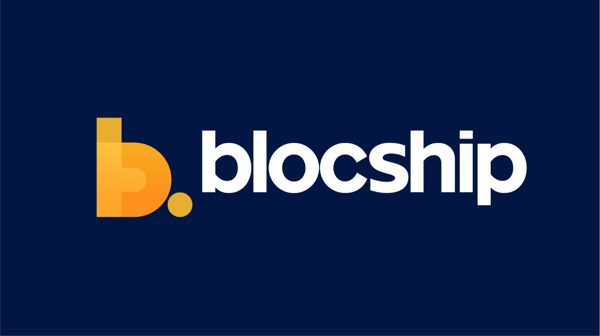

<!-- PROJECT LOGO -->
 

  <h1 align="center">Hey, this is us 👋</h1>

<!-- Image -->

At Blocship, our mission is to craft engaging mobile experiences for tomorrow's game-changers. We specialize in developing mobile applications for innovative startups, and we are passionate about helping these companies succeed.

### 🚀 We Build Mobile Apps

Our team is constantly researching the latest trends and tools in the world of mobile app development, and we are always on the lookout for new ways to push the boundaries of what is possible. **Flutter SDK** is a core tool we use to build top-notch applications for both iOS and Android platforms. 🚀

### 🤝 Contributing to the ecosystem

Beyond startups, we actively contribute to the tools we rely on. We have a number of open-source projects that we are proud to contribute to the developer community. Collaboration and knowledge-sharing are integral to our ethos, allowing us to connect with fellow developers and learn from their expertise. 🤝

### 📈 Our Clients are Our Partners

Our clients come from all over the world, including the United States, Australia, Bulgaria, Greece, and Pakistan. We are proud to work with such a diverse group of clients, and we are always looking for new opportunities to help innovative startups bring their ideas to life through mobile app development.

### 🚀 Empowerment, Passion, and Success

We are committed to crafting engaging mobile experiences for tomorrow's game-changers. We are passionate about what we do, and we are always looking for new ways to help our clients succeed. Join us on our journey to empower the next generation of innovators and entrepreneurs!

  

     
     
    <a href="https://blocship.io/">About us</a>
    ·
    <a href="https://www.linkedin.com/company/blocship/">LinkedIn</a>
    ·
    <a href="">Email</a>
  
